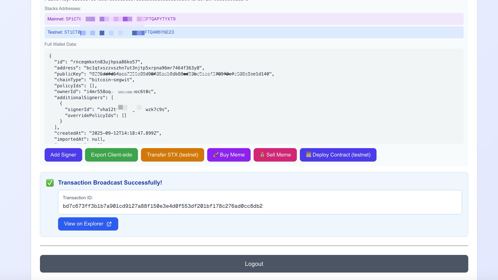

# Privy-Stacks Integration Demo

A comprehensive Next.js demo application showcasing how to integrate [Privy](https://privy.io)'s authentication and wallet management features with the Stacks blockchain. This project demonstrates advanced wallet operations, transaction signing, and interaction with Stacks smart contracts.




## Features

### 🔐 Authentication & Security
- **Email Authentication**: Secure OTP-based user login
- **Quorum Key Management**: Advanced multi-signature security setup
- **Session Signers**: Delegated transaction signing capabilities
- **Server-side Wallet Operations**: Secure wallet management through API endpoints

### 💼 Wallet Management
- **Multi-Wallet Support**: Create both client-side and server-side wallets
- **Stacks Address Generation**: Automatic Stacks address derivation from Ethereum keys
- **Private Key Export**: Secure key extraction for both wallet types
- **Cross-Network Support**: Testnet and mainnet compatibility

### 🔗 Stacks Blockchain Integration
- **STX Token Transfers**: Send STX tokens on testnet/mainnet
- **Smart Contract Deployment**: Deploy custom contracts to Stacks
- **Contract Interactions**: Call existing smart contract functions
- **Transaction Broadcasting**: Robust transaction submission with recovery testing

### 🎯 Advanced Features
- **Meme Token Trading**: Buy/sell tokens on STX.city bonding curves (mainnet)
- **Signature Recovery Testing**: Automatic recovery ID optimization for transaction success
- **Post-Condition Management**: Safe transaction execution with spending limits
- **Comprehensive Error Handling**: Detailed transaction failure diagnostics

## Project Structure

```
src/
├── app/api/                    # API endpoints
│   ├── buy-meme/              # Buy meme tokens on mainnet
│   ├── buy-meme-testnet/      # Buy meme tokens on testnet
│   ├── sell-meme/             # Sell meme tokens on mainnet
│   ├── create-wallet/         # Create new Privy wallets
│   ├── export-key/            # Export wallet private keys
│   ├── get-wallet/            # Retrieve wallet information
│   ├── transfer-stx/          # STX token transfers
│   └── deploy-contract/       # Smart contract deployment
├── utils/
│   ├── exportPrivyWallet.ts   # Wallet key export utilities
│   ├── privy-server-client.ts # Privy server client setup
│   └── stacks.ts              # Stacks signature utilities
└── ...
```

## Setup Instructions

### 1. Install Dependencies

```bash
npm install
```

### 2. Environment Configuration

Create a `.env.local` file based on `.env.local.example`:

```bash
cp .env.local.example .env.local
```

Configure the following environment variables:

```env
# Privy Configuration
NEXT_PUBLIC_PRIVY_APP_ID=your_privy_app_id
PRIVY_APP_SECRET=your_privy_app_secret

# Quorum Keys (Advanced Security)
QUORUMS_PUBLIC_KEY=your_quorum_public_key
QUORUMS_PRIVATE_KEY=your_quorum_private_key
QUORUMS_KEY=your_quorum_key_identifier
```

#### Understanding Quorum Keys

[Quorum Keys](https://docs.privy.io/controls/key-quorum/overview) provide advanced security through configurable "m-of-n" authorization requirements. Key features:

- **Flexible Authorization**: Configure multiple authorization keys with threshold requirements
- **Multi-signature Security**: Distribute authorization across different servers or entities
- **Customizable Policies**: Define specific authorization rules for different operations

**Setup Process:**
1. Contact Privy to enable key quorum for your application
2. Generate authorization key pairs for your security setup
3. Configure the threshold requirements (e.g., 2-of-3 keys required)
4. Distribute keys across your infrastructure securely

### 3. Privy Dashboard Configuration

1. **Create Privy App**: Visit [Privy Console](https://console.privy.io) and create a new application
2. **Configure Networks**: Enable Ethereum and Stacks network support
3. **Set Allowed Origins**: Add your development/production domains
4. **API Keys**: Generate and securely store your App ID and Secret

### 4. Session Signers Setup

Implement [session signers](https://docs.privy.io/wallets/using-wallets/session-signers/add-session-signers#add-signers) for delegated wallet operations:

```typescript
import { useSessionSigners } from '@privy-io/react-auth';

const { addSessionSigners } = useSessionSigners();

// Add session signer to wallet
await addSessionSigners({
  address: "wallet_address",
  signers: [{
    signerId: "your_quorum_key_id",
    policyIds: ["optional_policy_constraints"]
  }]
});
```

**Benefits:**
- Enable third-party transaction authorization
- Implement controlled, time-limited wallet access
- Support automated trading or DeFi operations
- Maintain security through policy restrictions

## Development Workflow

### 1. Start Development Server

```bash
npm run dev
```

Navigate to [http://localhost:3000](http://localhost:3000)

### 2. Stacks Wallet Operations

#### Create Stacks Wallets
1. Log in with email authentication
2. Create a new wallet through `/api/create-wallet`
3. The system automatically generates Stacks addresses from Ethereum keys

#### Deposit STX (Testnet)
1. Get your testnet address from the wallet interface
2. Use [Stacks Testnet Faucet](https://explorer.stacks.co/sandbox/faucet) to fund your wallet
3. Wait for confirmation (typically 1-2 minutes)

#### STX Transfers
- Use `/api/transfer-stx` endpoint for testnet transfers
- Transfers include automatic signature recovery testing
- Monitor transactions via [Stacks Explorer](https://explorer.stacks.co)

#### Smart Contract Deployment
- Deploy contracts via `/api/deploy-contract`
- Supports both Clarity and custom contract deployment
- Automatic fee estimation and optimization

### 3. Mainnet Meme Token Trading

#### Buy Meme Tokens
Endpoint: `/api/buy-meme/route.ts`

```typescript
// Current implementation (needs customization)
const currentWallet = 'SPJ7N2FGH300NS65SHDBMWR42RAZGK3NN127DJVS' // ⚠️ Replace with dynamic wallet
const amountInMicroSTX = 100000 // 0.1 STX
const tokenContract = 'SP11Z0M9SXMXM2BGQHDPT0B9Z03TDE56WFSF6EEX8.gm-stxcity'
```

#### Sell Meme Tokens
Endpoint: `/api/sell-meme/route.ts`

```typescript
// Current implementation (needs customization)
const currentWallet = 'SPJ7N2FGH300NS65SHDBMWR42RAZGK3NN127DJVS' // ⚠️ Replace with dynamic wallet
const tokenSell = 2279877495 // Token amount to sell
```

**⚠️ Important**: Replace hardcoded wallet addresses with dynamic user wallet addresses before production use.

#### STX.city Integration
- Interacts with STX.city bonding curve contracts
- Automatic price calculation and slippage protection
- Post-condition verification for safe trading

## Advanced Features

### Signature Recovery Testing

This project includes a sophisticated signature recovery system (`broadcastWithRecoveryTesting` in `src/utils/stacks.ts`) that addresses Stacks blockchain signature challenges.

#### The Challenge
Stacks transactions require precise signature formatting with correct recovery IDs. Due to differences between Ethereum and Stacks signature systems, raw signatures from wallet providers often need recovery ID adjustment.

#### Our Solution
Based on [Hiro's transaction signature analysis](https://www.hiro.so/blog/dissecting-a-transaction-signature-on-stacks), we implement:

**1. Signature Format Conversion**
```typescript
// Convert Ethereum-style signature to Stacks VRS format
const signature = {
  v: recoveryId,    // 1-byte recovery identifier
  r: rComponent,    // 32-byte curve x-coordinate
  s: sComponent     // 32-byte scalar value
}
```

**2. Systematic Recovery Testing**
```typescript
export async function broadcastWithRecoveryTesting(
  signature: string,
  createTransactionFn: (recoveryId: string) => Promise<any>,
  broadcastFn: (transaction: any) => Promise<any>,
  apiPrefix: string
): Promise<{success: boolean, response: any, signatureData: any}>
```

**Process:**
1. Generate signature variants with recovery IDs: `['00', '01', '02', '03']`
2. Test in priority order (01, 00, 02, 03) based on success patterns
3. Broadcast transaction with each variant until success
4. Return successful signature data or detailed error information

**Benefits:**
- **Higher Success Rate**: Automatically finds correct recovery ID
- **Reduced Failed Transactions**: Prevents signature validation errors
- **Development Efficiency**: Eliminates manual signature debugging
- **Production Reliability**: Robust error handling and logging

#### Implementation Example
```typescript
const result = await broadcastWithRecoveryTesting(
  walletSignature,
  async (recoveryId) => await createUnsignedTransaction(recoveryId),
  async (tx) => await broadcastTransaction(tx),
  'STX-TRANSFER'
);

if (result.success) {
  console.log(`Transaction successful with recovery ID: ${result.signatureData.v}`);
}
```

## API Reference

### Authentication Endpoints
- `POST /api/create-wallet` - Create new Privy wallet
- `GET /api/get-wallet` - Retrieve wallet information
- `POST /api/export-key` - Export wallet private key

### Transaction Endpoints
- `POST /api/transfer-stx` - Send STX tokens (testnet)
- `POST /api/deploy-contract` - Deploy smart contracts
- `POST /api/buy-meme` - Buy meme tokens (mainnet)
- `POST /api/sell-meme` - Sell meme tokens (mainnet)
- `POST /api/buy-meme-testnet` - Buy meme tokens (testnet)

### Request Format
All endpoints expect:
```typescript
{
  "walletId": "privy_wallet_id",
  "Authorization": "Bearer privy_access_token"
}
```

## Security Considerations

- **Private Key Management**: Keys are encrypted and managed server-side
- **Token Authentication**: All API calls require valid Privy tokens
- **Post-Condition Verification**: Transactions include spending limits
- **Network Isolation**: Separate testnet/mainnet configurations
- **Error Handling**: Comprehensive logging without sensitive data exposure

## Testing & Development

### Testnet Testing
1. Use testnet faucets for STX funding
2. Deploy test contracts for interaction testing
3. Monitor transactions on testnet explorer
4. Validate signature recovery across different scenarios

### Mainnet Preparation
1. Test thoroughly on testnet first
2. Replace hardcoded addresses with dynamic values
3. Implement proper error handling for production
4. Set appropriate transaction fees for mainnet conditions

## Dependencies

### Core Dependencies
- `@privy-io/react-auth` - Privy authentication
- `@privy-io/server-auth` - Server-side Privy operations
- `@stacks/transactions` - Stacks transaction creation
- `@stacks/network` - Network configuration
- `@stacks/wallet-sdk` - Wallet utilities

### Development Tools
- `Next.js 15.5.2` - React framework with API routes
- `TypeScript 5` - Type safety
- `Tailwind CSS 4` - Styling framework

## Resources

### Documentation
- [Privy Documentation](https://docs.privy.io/)
- [Stacks Documentation](https://docs.stacks.co/)
- [Quorum Keys Guide](https://docs.privy.io/controls/key-quorum/overview)
- [Session Signers Guide](https://docs.privy.io/wallets/using-wallets/session-signers/add-session-signers)

### Technical References
- [Stacks Transaction Signatures](https://www.hiro.so/blog/dissecting-a-transaction-signature-on-stacks)
- [Stacks Explorer](https://explorer.stacks.co/)
- [STX.city](https://stx.city) - Meme token trading platform

## Troubleshooting

### Common Issues

**Signature Validation Errors**
- Ensure `broadcastWithRecoveryTesting` is implemented
- Verify signature format conversion (VRS order)
- Check recovery ID generation logic

**Transaction Failures**
- Validate post-conditions and spending limits
- Confirm sufficient STX balance for fees
- Verify contract addresses and function names

**Authentication Issues**
- Check Privy app configuration and API keys
- Verify allowed origins in Privy dashboard
- Ensure proper token handling in API requests

**Network Configuration**
- Confirm testnet/mainnet settings match intended network
- Validate RPC endpoints and network connectivity
- Check fee estimates for current network conditions

## Contributing

This demo showcases advanced Privy-Stacks integration patterns. When extending:

1. Follow existing error handling patterns
2. Implement comprehensive logging for debugging
3. Add signature recovery testing for new transaction types
4. Maintain separation between testnet and mainnet operations
5. Update documentation for new features

## License

This project is for demonstration purposes. Please ensure compliance with all relevant licenses when adapting for production use.